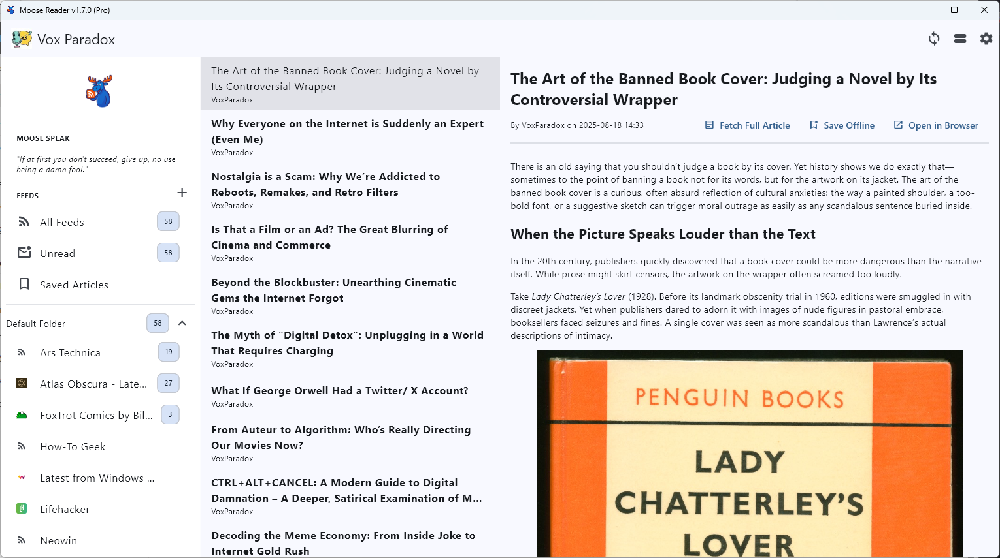
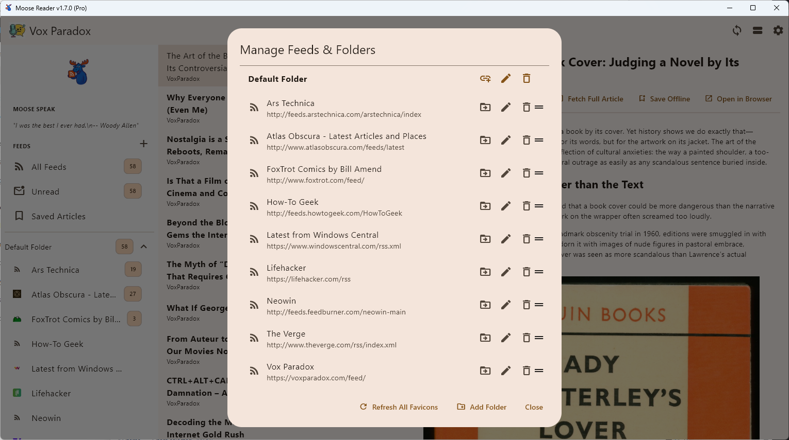
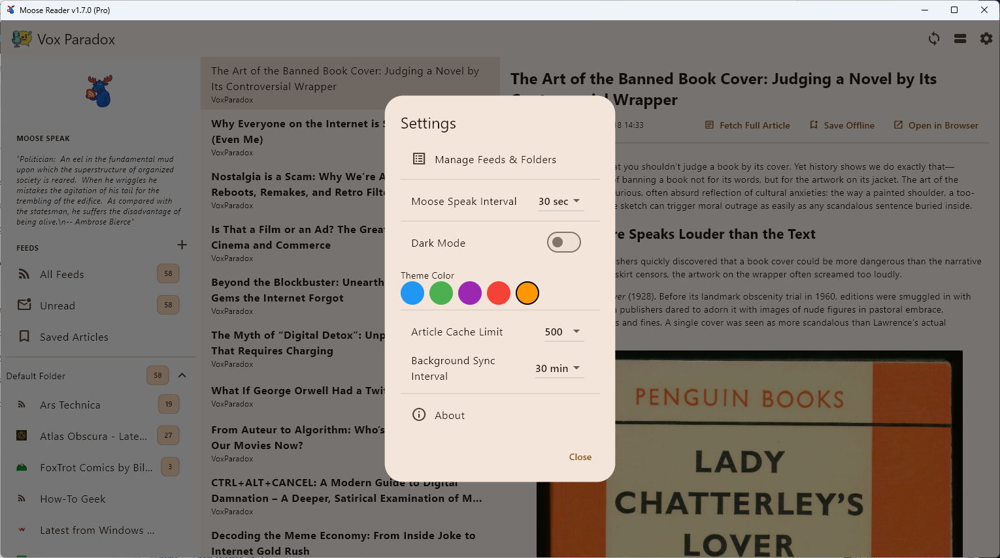

# 🦌 Moose Reader

*Your content, beautifully organized. A simple, powerful, and elegant RSS reader for your desktop.*

Moose Reader is a minimalist but feature-rich desktop RSS reader built with Flutter. It focuses on providing a clean, distraction-free reading experience while giving you full control over your feeds and folders locally, without the need for a cloud account.

---
## ✨ Features

* **100% Local:** All your feeds, folders, and articles are stored locally in a high-performance SQLite database. No cloud account required.
* **Powerful Feed Management:**
    * Organize feeds into collapsible **folders**.
    * **Add, edit (title and URL), move, and delete** feeds with ease.
    * **Drag-and-drop** to manually reorder feeds within a folder.
    * **Create, rename, and delete** folders.
    * **Fetch full articles** for feeds.
* **Smart & Automatic:**
    * **Favicon Support:** Automatically fetches and displays website icons for your feeds.
    * **Background Syncing:** Set an interval to have the app fetch new articles automatically.
    * **Data Cleanup:** Includes routines to clean up orphaned articles and feeds, keeping your database healthy.
* **Elegant UI & UX:**
    * Classic three-pane layout (Folders/Feeds, Article List, Reading Pane).
    * **Switchable Layout:** Instantly toggle between a vertical or horizontal split for the article and reading panes.
    * **Window Persistence:** Remembers its size and position between sessions.
    * **Dynamic Title:** The window title proudly displays the app name and version.
* **Productivity:**
    * **OPML Import:** Easily import your existing feed collection from another reader.
    * **Mark All as Read:** Quickly clear unread counts by folder, for all feeds, or per-feed by clicking the unread count bubble.

---
## 🎨 Settings & Customization

Fine-tune your reading experience from the settings dialog.

* **Dark & Light Mode:** Choose the theme that's easiest on your eyes.
* **Theme Accent Color:** Pick from a selection of accent colors to personalize the UI.
* **Article Cache Limit:** Control how many old articles are kept in the database to manage disk space.
* **Sync Interval:** Decide how often the app should check for new articles in the background, or turn it off completely.

---
## 🛠️ Built With

* [Flutter](https://flutter.dev/) - The UI toolkit for building beautiful, natively compiled applications.
* [sqflite_common_ffi](https://pub.dev/packages/sqflite_common_ffi) - For local SQLite database storage on desktop.
* [webfeed_plus](https://pub.dev/packages/webfeed_plus) - For robust RSS/Atom feed parsing.
* [flutter_html](https://pub.dev/packages/flutter_html) - For rendering article content in the reading pane.
* [window_manager](https://pub.dev/packages/window_manager) - For controlling the desktop window.
* [package_info_plus](https://pub.dev/packages/package_info_plus) - For reading the app's version number.

---
## 📄 License
All rights are reserved by the author, V Shah. You may not copy, modify, merge, publish, distribute, sublicense, and/or sell copies of the software without explicit written permission from the author. You are, however, free to download and use the application provided in the Releases section.
